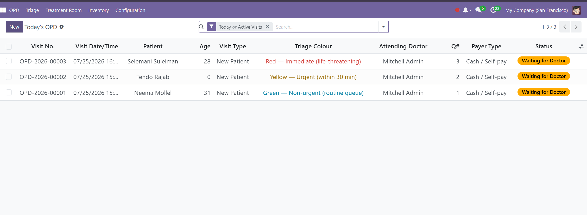
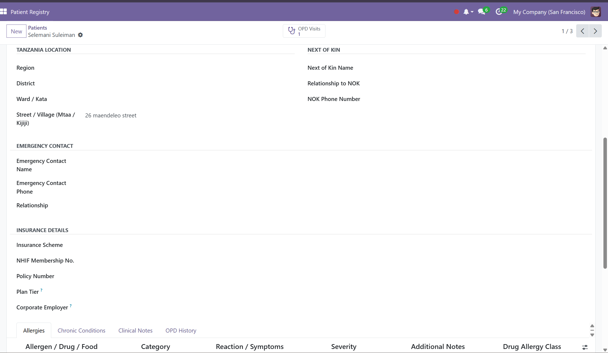
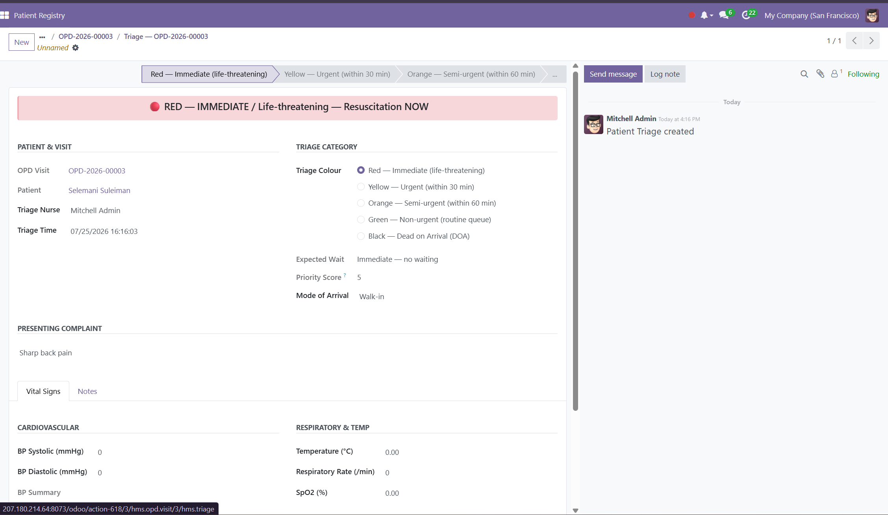
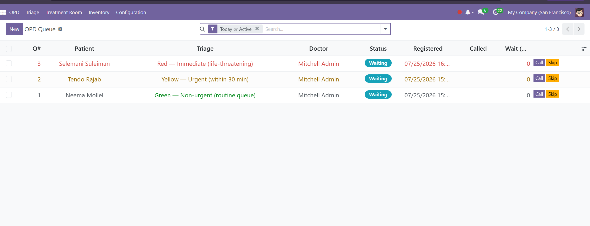
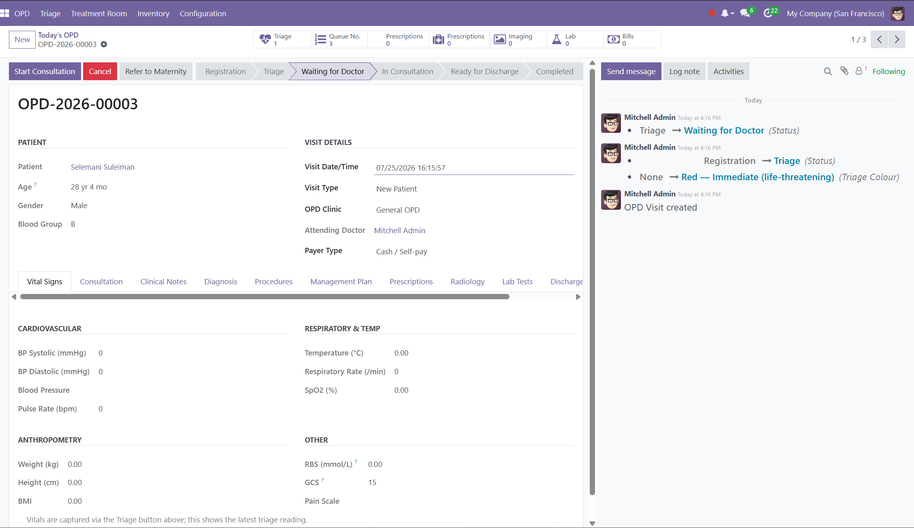
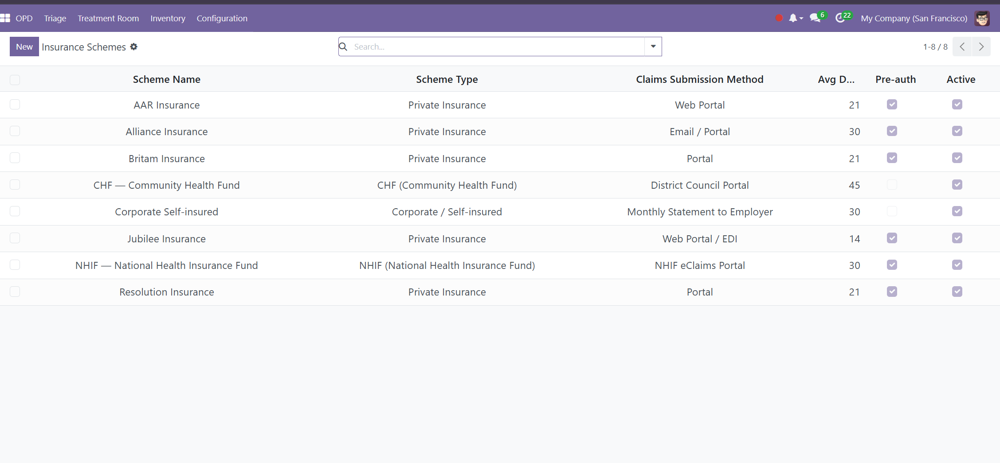
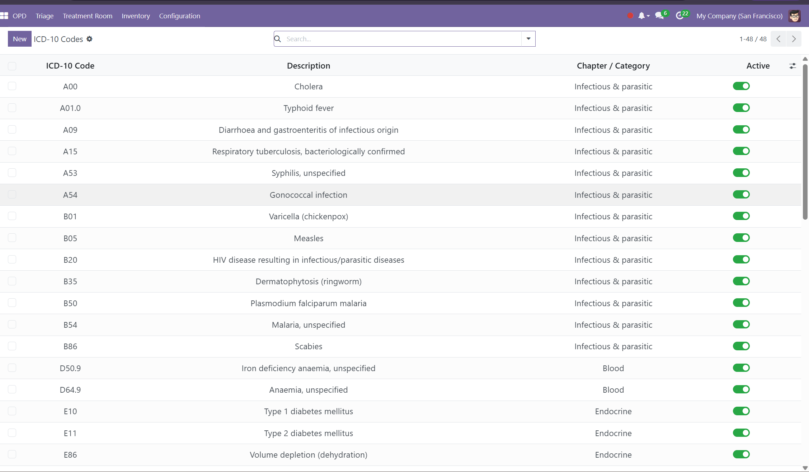

# nestHMS — Outpatient Department (OPD) for Odoo 18

> **A complete outpatient hospital system on Odoo 18 — patient registration to discharge, triage, queue, insurance and billing — running in production across two healthcare facilities in Tanzania.**

The **Outpatient Department** module of **nestHMS**, a full Hospital Management System built on
Odoo. It runs the entire outpatient journey — **Registration → Triage → Queue → Consultation →
Vitals → Diagnosis → Discharge** — as one connected workflow, built for the realities of
Tanzanian healthcare (NHIF/CHF insurance, cash-first payment rules, the 31-region structure).

> Running in production · Built on **Odoo 18** · Licensed LGPL-3
> The **root module** of the nestHMS suite — installs standalone (core Odoo only: `mail`, `hr`, `product`, `stock`).


## See it in action

**A live outpatient department running the full patient journey on Odoo 18.**



| Patient registration | 5-level colour-coded triage |
|---|---|
|  |  |

| Live queue board | Consultation workspace |
|---|---|
|  |  |

| Insurance & payer schemes | ICD-10 diagnosis catalogue |
|---|---|
|  |  |

---

## The problem this solves

A Tanzanian healthcare facility was running outpatient operations on paper and disconnected
spreadsheets. There was no single record of a patient's journey through the building — so:

- **Patients fell through the cracks** — no unified visit record; staff re-asked the same
  questions and lost track of who was waiting, seen, or still owed money.
- **Revenue leaked** — cash patients could reach a doctor without paying the consultation fee first.
- **No triage discipline** — nothing enforced *who is most urgent*; sick patients waited behind routine ones.
- **Insurance was manual** — NHIF / CHF / corporate payers tracked by hand, inviting rejected claims.
- **Off-the-shelf software didn't fit** local healthcare realities.

## What this module does

- 🧑‍⚕️ **Patient master record** — Tanzania-specific fields (NHIF/CHF numbers, 31-region
  administrative structure, next-of-kin), with paediatric and geriatric **auto-flagging** and allergy alerts.
- 📝 **One controlled visit lifecycle** — Registration → Triage → Waiting → Consultation →
  Investigation → Discharge → Completed, each stage timestamped. A patient **can't be registered
  twice at once** — the system blocks a duplicate active visit.
- 🚦 **5-level colour-coded triage** (Red / Orange / Yellow / Green / Black) with automatic
  priority — the sickest patients rise to the top of the queue, not the first to arrive.
- ⏱️ **Digital patient queue** with wait-time tracking, replacing the paper line.
- 💳 **A revenue safeguard built into the workflow** — cash patients **cannot proceed to triage
  until the consultation fee is collected**. Enforced by the system, not by staff memory.
- ❤️ **Vital signs** capture per visit (BP, temperature, SpO₂, pulse, BMI, GCS, pain scale).
- 🩺 **ICD-10 diagnosis** from a preloaded code set (primary / secondary / differential).
- 🏦 **Insurance & payer support** — NHIF, CHF, private schemes (Jubilee, AAR, Britam, …) and
  corporate self-insured, each with claims method, settlement days, and pre-authorization rules.
- 📦 **Department requisition & consumables** — OPD draws consumables from its own store location
  via a shared requisition sequence.
- 🧾 **Service catalogue** — consultations, procedures, and lab tests modelled as Odoo products so
  revenue routes cleanly into accounting.

## The result

- **In production across two facilities** — a referral hospital and a dispensary — running the full outpatient workflow daily.
- **30+ staff** rely on the system day to day, across reception, triage, consultation, and administration.
- **Replaced a patchwork of disconnected systems with one all-in-one ERP.** A major pain point was juggling several separate tools to get a single job done — nestHMS unified it, and this OPD module is the front door of that suite.
- **Closed the cash-payment gap** — consultation fees are collected before the patient is seen, because the workflow won't advance until they are.

---

## About nestHMS

nestHMS is a full hospital ERP built as a suite of integrated Odoo modules covering the entire
patient journey and hospital operations:

**Clinical:** OPD (this module) · IPD (wards & beds) · Theatre · Laboratory · Radiology ·
Pharmacy · Dental · Physiotherapy · Maternity · RCH · Emergency (EMD) · Ambulance · Mortuary
**Financial & support:** Billing · Insurance claims · shared Inventory framework

This repository publishes the **OPD & Patient Registration** module as an open-source work
sample. The wider suite is proprietary.

## Technical highlights

- Clean **state machine** on the visit model, with an ORM-level `create` guard that blocks a
  second active visit per patient, and a **payment-gated triage action** for cash payers.
- **Domain model** split across patient, visit, triage, queue, vitals, procedure, ICD-10,
  visit-type, insurance-scheme and requisition models; computed billing-balance and latest-vitals fields.
- **Registration & visit-launcher wizards** that guide front-desk staff through a fast, validated intake.
- **Security groups & record rules** scoping access to clinical vs. front-desk vs. administrative roles.
- **Preloaded Tanzania reference data** — 31 regions, ICD-10 codes, national + private insurance
  schemes, visit types, and OPD service catalogue — so the module is usable on install.
- Built with real **clinical domain knowledge** (the author's background is nursing), which is why
  the triage, acuity, and payer logic map to how hospitals actually operate.

## Repository structure

```
odoo_hms_opd/
├─ models/          # patient, visit, triage, queue, vitals, procedure, ICD-10, insurance…
├─ wizard/          # patient registration + visit launcher wizards
├─ views/           # forms, lists, queue board, menus
├─ security/        # groups, access rights, record rules
└─ data/            # regions, ICD-10, insurance schemes, services, sequences (Tanzania)
```

## Installation

1. Copy `odoo_hms_opd` into your Odoo addons path.
2. Update the apps list and install **nestHMS - OPD & Patient Registration**.
3. Open the **nestHMS / OPD** menu to register a patient and start a visit.

**Requires:** `mail`, `hr`, `product`, `stock` (core Odoo only).

---

## About

Built by **Albin Lema** — Odoo developer & ERP consultant, founder of CodeNest Tanzania, with a
clinical background (BSc Nursing). I build and deploy complete Odoo ERP systems in production —
this hospital management suite, payroll, point of sale, and business-workflow modules.

- 🌐 [codenest.co.tz](https://codenest.co.tz)
- 💻 [github.com/lemalbin](https://github.com/lemalbin)
- 📧 asanterabialbin@gmail.com

_The OPD module is published as an open-source work sample. Licensed under LGPL-3._
